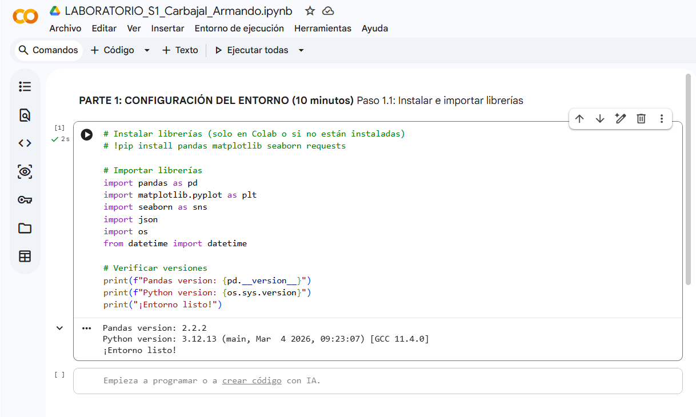
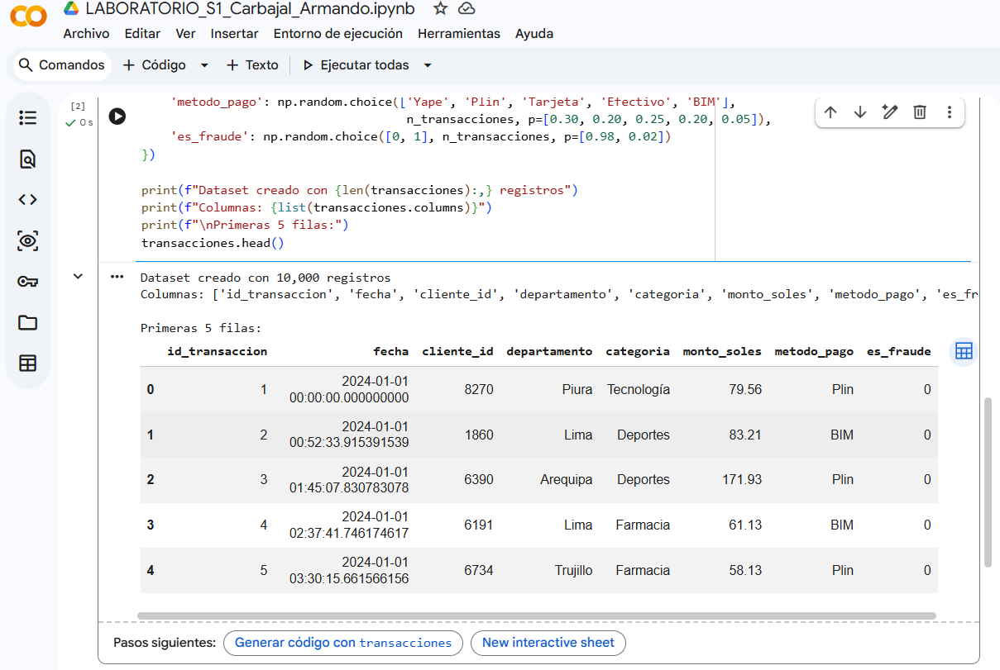
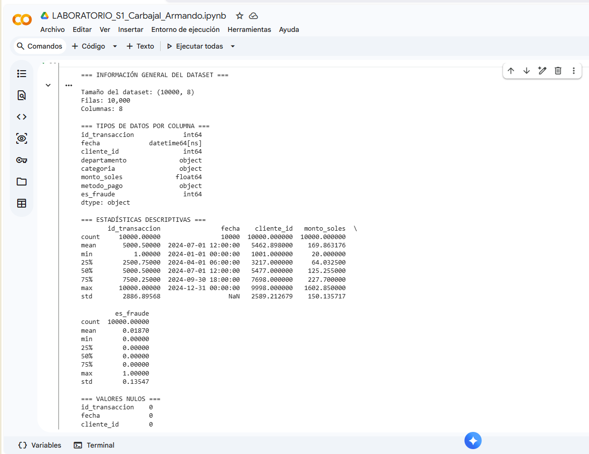
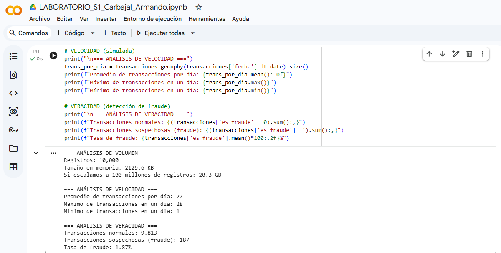
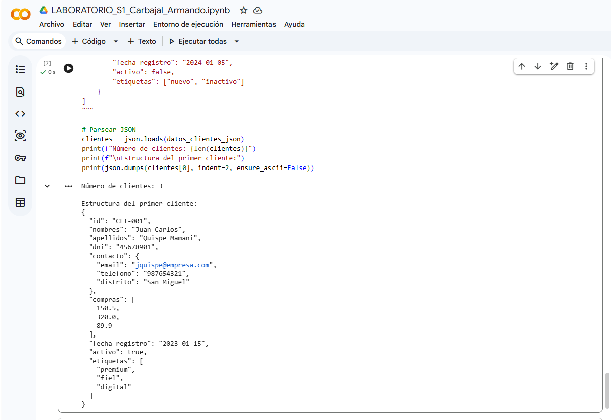
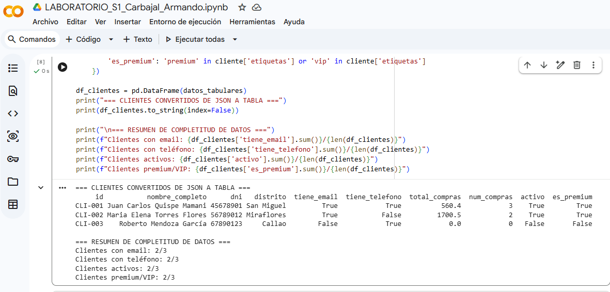
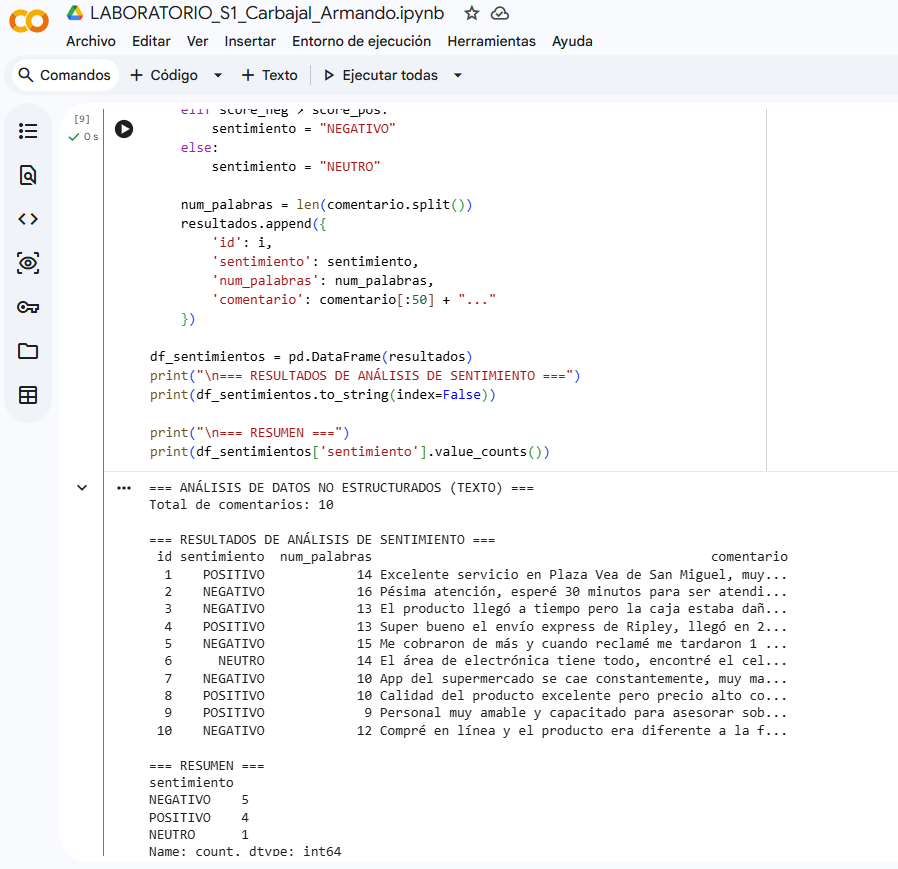
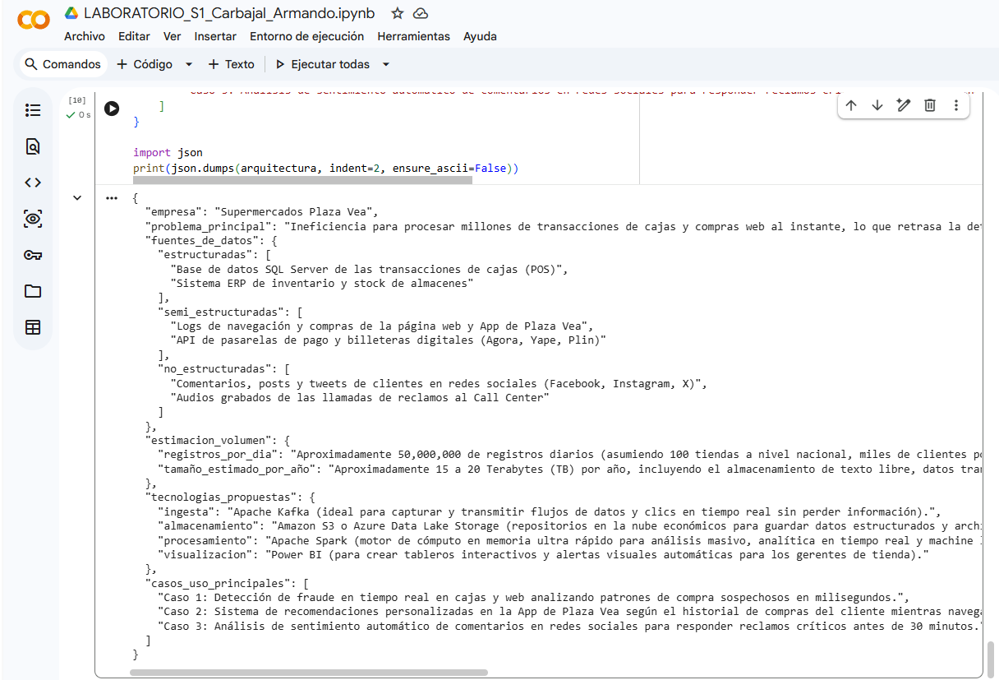

# Capturas de Ejecución COLAB LABORATORIO SEMANA 01  - BIGDATA
**Estudiante**: Armando Jheferson Carbajal Campomanes  
**Fecha**: 12/06/2026  

---

## Evidencias del Laboratorio

### CapturaColab1_Librerias

### CapturaColab2_Dataset

### CapturaColab3_Exploracion

### CapturaColab4_AnalisisDeMetrica

### CapturaColab5_Datos_SemiEstructuradosa

### CapturaColab6_DATOS SEMI-ESTRUCTURADOS — JSON 

### CapturaColab7_Datos_No_Estructurados

### CapturaColab8_Template_Empresa
