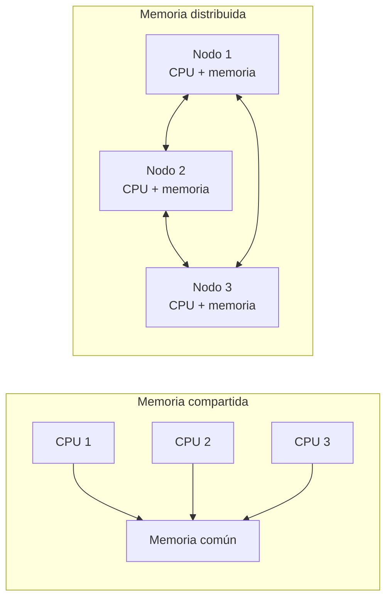

# GUÍA DE TRABAJO RESUELTA - SEMANA 1
## Big Data (DD283) | Universidad Autónoma del Perú

**Nombre(s)**: Hidgar Orellano Huerta
**Grupo de proyecto**: 04
**Fecha**: 12/06/2026 
**Modalidad**: Individual

---

## PARTE 1: CONCEPTOS FUNDAMENTALES DE BIG DATA

### Pregunta 1

Big Data es el conjunto de datos que, por su gran tamaño, rapidez de generación o diversidad, ya no puede administrarse eficientemente con herramientas convencionales. También comprende las tecnologías y métodos que permiten almacenar, procesar y analizar esos datos para obtener información útil.

La diferencia fundamental con una base de datos tradicional como SQL Server o MySQL no es únicamente la cantidad de datos. Una base relacional funciona mejor cuando la información tiene una estructura definida, relaciones claras y puede procesarse en uno o pocos servidores. En cambio, Big Data trabaja también con textos, audios, imágenes, videos, eventos de sensores y registros web. Para atender esa escala suele distribuir el almacenamiento y el procesamiento entre varios servidores de un clúster. Esto permite crecer horizontalmente, es decir, agregando nodos, y ejecutar tareas en paralelo.

---

### Pregunta 2

Se toma como ejemplo una empresa peruana de telecomunicaciones.

| V | Definición con mis palabras | Ejemplo en una empresa de telecomunicaciones |
|---|---|---|
| **Volumen** | Cantidad total de información que se genera y almacena. | Millones de registros diarios de llamadas, navegación, recargas, pagos y consumo de datos móviles. |
| **Velocidad** | Rapidez con la que los datos llegan y deben ser procesados. | La empresa debe detectar una falla de red o una transacción sospechosa pocos segundos después de que ocurre. |
| **Variedad** | Existencia de información en distintos formatos y fuentes. | Tablas de clientes, archivos JSON, logs de antenas, grabaciones del call center, correos y comentarios en redes sociales. |
| **Veracidad** | Nivel de calidad, precisión y confianza de los datos. | Un mismo cliente puede aparecer con direcciones distintas o pueden existir registros incompletos de consumo. |
| **Valor** | Beneficio que se obtiene al convertir los datos en decisiones. | Identificar clientes con riesgo de cancelar el servicio y ofrecerles un plan adecuado antes de que se retiren. |

---

### Pregunta 3

Una empresa como el BCP sí puede utilizar Oracle para operaciones bancarias críticas, pero no sería conveniente depender de una sola base de datos Oracle tradicional para todo el procesamiento analítico y en tiempo real.

**Razones técnicas:**

1. **Escalabilidad:** millones de transacciones, consultas, eventos de aplicaciones y operaciones digitales pueden superar la capacidad de un único servidor. Una arquitectura distribuida reparte el trabajo entre varios nodos.
2. **Diversidad de información:** además de tablas bancarias, se procesan logs, datos de dispositivos, documentos, mensajes, ubicaciones y eventos de ciberseguridad. No todo encaja naturalmente en un modelo relacional.
3. **Procesamiento en tiempo real:** la detección de fraude necesita analizar cada operación en segundos o milisegundos. Si el análisis pesado comparte recursos con la base transaccional, podría afectar operaciones críticas.
4. **Disponibilidad y tolerancia a fallos:** una plataforma distribuida puede replicar los datos y continuar trabajando aunque falle un nodo. Depender de un solo sistema incrementa el riesgo operativo.

**Razón de negocio:** el banco necesita responder rápidamente ante fraude, personalizar ofertas y conocer mejor al cliente. Si los análisis tardan horas o días, puede perder dinero, clientes y oportunidades comerciales.

---

### Pregunta 4

| Dato | Clasificación | Justificación |
|---|---|---|
| Un archivo Excel con ventas mensuales | **Estructurado** | La información se organiza en filas, columnas y tipos de campos definidos. |
| Un tweet sobre el precio del dólar | **Semi-estructurado** | Tiene metadatos definidos, como usuario, fecha e identificador, pero el texto es libre. |
| Una foto del ticket de compra en Metro | **No estructurado** | Es una imagen sin filas ni columnas consultables directamente; requiere OCR o visión artificial para extraer datos. |
| Un archivo JSON de la API de SUNAT | **Semi-estructurado** | Utiliza claves, valores y jerarquías, pero no exige una tabla rígida para todos los registros. |
| Un audio de una llamada al call center de Claro | **No estructurado** | Su contenido principal es sonido y lenguaje natural; necesita reconocimiento de voz para analizarse como texto. |
| Un archivo CSV de exportaciones del BCRP | **Estructurado** | Cada registro sigue columnas y delimitadores conocidos. |
| Un video de seguridad de un supermercado | **No estructurado** | Contiene imágenes y sonido continuos sin un esquema tabular previamente definido. |
| Un log de errores de un servidor web | **Semi-estructurado** | Suele repetir campos como fecha, nivel y código, pero el mensaje puede variar y contener texto libre. |

---

### Pregunta 5

Un **clúster** es un conjunto de computadoras o nodos conectados que colaboran como si fueran un solo sistema. En Big Data, los datos y las tareas se reparten entre esos nodos. Así se puede procesar más información, agregar capacidad y continuar operando si una máquina falla.

En un sistema de **memoria compartida**, varios procesadores acceden a una misma memoria central. La comunicación es rápida, pero la memoria y el bus común pueden convertirse en cuellos de botella. Generalmente se escala aumentando la capacidad de una máquina.

En un sistema de **memoria distribuida**, cada nodo posee su propia memoria y se comunica con los demás mediante una red. Este modelo permite agregar servidores y procesar datos en paralelo, aunque requiere coordinar la comunicación y la distribución de la información.



---

### Pregunta 6

**Empresa investigada:** Grupo Bafar, México.  
**Fuente consultada:** [Caso de éxito de Grupo Bafar en Google Cloud](https://cloud.google.com/customers/grupobafar)

Grupo Bafar es una empresa mexicana con actividades en manufactura, venta minorista, distribución, finanzas y agroindustria. Su problema principal era que la información estaba separada en diferentes sistemas y áreas. Por ejemplo, la unidad minorista y la de manufactura utilizaban sistemas ERP distintos, mientras que otros datos se encontraban en SAP, Salesforce y bases independientes. Esta fragmentación dificultaba obtener una visión confiable del negocio, generaba reportes duplicados y obligaba a los trabajadores a invertir demasiado tiempo en revisar información.

La empresa implementó una plataforma de datos en Google Cloud. Utilizó Cortex Framework para integrar y replicar información procedente de SAP, Salesforce y otros sistemas. Después centralizó los datos en un lago de datos basado en BigQuery y empleó Looker para la visualización. También incorporó prácticas de gobierno de datos y desarrolló agentes de inteligencia artificial con Vertex AI.

Según el caso publicado por Google Cloud, la solución mejoró la consistencia y precisión de los reportes. Los ejecutivos de ventas ahorraron aproximadamente tres horas diarias en elaboración y revisión de informes. Además, un agente usado por 300 empleados eliminó cerca de 900 horas diarias de análisis manual acumulado. El resultado muestra que Big Data no consiste solo en guardar grandes cantidades de información: su utilidad aparece cuando se integran fuentes, se asegura la calidad y se facilita que las personas tomen decisiones oportunas.

---

### Pregunta 7

| Aspecto | Data Lake | Data Warehouse |
|---|---|---|
| **Definición** | Repositorio que conserva grandes cantidades de datos, normalmente en su formato original. | Repositorio de datos integrados, limpios y organizados para análisis empresarial. |
| **Tipo de datos** | Estructurados, semi-estructurados y no estructurados. | Principalmente estructurados y con un esquema definido. |
| **Cuándo usarlo** | Cuando todavía no se conocen todos los análisis futuros o se necesita almacenar datos crudos para ciencia de datos y aprendizaje automático. | Cuando se requieren indicadores estables, reportes financieros, tableros y consultas frecuentes del negocio. |
| **Ejemplo de negocio** | Una empresa de telecomunicaciones guarda logs de red, audios, eventos de aplicaciones y registros de navegación para crear modelos predictivos. | La misma empresa consolida ventas, facturación y clientes para calcular ingresos mensuales y comparar resultados por región. |
| **Herramienta típica** | Amazon S3, Azure Data Lake Storage o Hadoop HDFS. | Snowflake, Amazon Redshift, Google BigQuery o Azure Synapse. |

El Data Lake ofrece flexibilidad, pero necesita catálogo, seguridad y gobierno para no convertirse en un depósito desordenado. El Data Warehouse ofrece datos más preparados y consistentes, aunque exige definir previamente la estructura y las reglas de transformación.

---

### Pregunta 8

Una arquitectura Big Data robusta debe cumplir requisitos técnicos que permitan convertir datos masivos en resultados confiables.

1. **Escalabilidad:** debe aumentar su capacidad cuando crecen los datos o los usuarios, preferiblemente agregando nodos. Si no se cumple, el sistema se vuelve lento, se satura y obliga a realizar migraciones costosas.
2. **Disponibilidad y tolerancia a fallos:** debe seguir operando aunque un servidor, disco o proceso falle. Para ello se usan réplicas y recuperación automática. Sin este requisito, una falla puede detener el servicio o causar pérdida de información.
3. **Rendimiento y baja latencia:** debe procesar los datos dentro del tiempo que necesita el negocio, ya sea por lotes o en tiempo real. Si no se cumple, una alerta de fraude, una recomendación o un reporte llega demasiado tarde.
4. **Seguridad, privacidad y gobierno:** debe controlar quién accede a los datos, cifrarlos, registrar su uso y cumplir normas como la Ley peruana de Protección de Datos Personales. Sin estos controles puede haber filtraciones, sanciones y pérdida de confianza.
5. **Calidad e integración de datos:** debe validar, limpiar y relacionar información procedente de distintas fuentes. Si no se cumple, los modelos y reportes producen resultados incorrectos, aunque la tecnología sea rápida y escalable.

Estos requisitos deben evaluarse de forma conjunta. Por ejemplo, una plataforma muy rápida pero insegura no es aceptable, y una plataforma con muchos datos pero sin calidad puede llevar a peores decisiones.

---

### Pregunta 9

Trabajo como analista de datos en la DGSFS-PA del Ministerio de la Producción (PRODUCE). Uno de los principales problemas que observo es la limitada modernización de la infraestructura tecnológica. La OGTI todavía mantiene una infraestructura principalmente física y SQL Server se utiliza para cubrir casi todas las necesidades: sistemas transaccionales, almacenamiento histórico, integración de información, consultas y elaboración de reportes. SQL Server es una herramienta sólida, pero depender de una sola tecnología para cargas tan diferentes puede ocasionar problemas de rendimiento, escalabilidad, disponibilidad y mantenimiento. También dificulta integrar grandes volúmenes de información procedentes de fiscalizaciones, expedientes, documentos, sistemas administrativos y otras fuentes.

En este caso están presentes varias V de Big Data. El **volumen** aumenta con los registros históricos y documentos generados; la **variedad** aparece porque existen tablas, hojas de cálculo, archivos, documentos y posiblemente información geográfica; la **velocidad** es necesaria para disponer oportunamente de información de supervisión y fiscalización; la **veracidad** resulta crítica porque pueden existir duplicados, campos incompletos o criterios diferentes entre sistemas; y el **valor** consiste en convertir esos datos en alertas, indicadores y evidencia para mejorar la toma de decisiones.

Como propuesta inicial, plantearía una modernización gradual. SQL Server podría mantenerse para los sistemas transaccionales que lo necesiten, mientras se implementa una plataforma separada para integración y analítica. Esta podría incluir procesos ETL, un repositorio central o Data Lake, un Data Warehouse para indicadores institucionales, reglas de calidad y un catálogo de datos. También sería conveniente evaluar una arquitectura híbrida o servicios de nube gubernamental según las normas de seguridad aplicables. Con ello se reduciría la carga sobre las bases operacionales, se facilitaría el análisis histórico y se mejorarían la disponibilidad, el respaldo y la capacidad de crecimiento.

---

### Pregunta 10

#### a) Cantidad de registros

Datos:

- Clientes: 8 000 000
- Registros por cliente al día: 500

```text
Registros diarios = 8 000 000 × 500
                   = 4 000 000 000
```

Se generan **4 mil millones de registros diarios**.

```text
Registros anuales = 4 000 000 000 × 365
                   = 1 460 000 000 000
```

En un año de 365 días se generan **1,46 billones de registros** según la escala numérica larga usada en español, es decir, **1,46 millones de millones**.

#### b) Tipos de datos involucrados

- **Estructurados:** pagos, datos del contrato, plan contratado, facturación y duración de llamadas.
- **Semi-estructurados:** logs de red, eventos de aplicaciones, archivos JSON y registros de navegación.
- **No estructurados:** audios del call center, correos, chats y comentarios escritos por los clientes.

#### c) V más relevantes

Las cinco V están presentes, pero destacan **volumen**, por los 4 mil millones de eventos diarios; **velocidad**, porque se requiere predecir y actuar antes de 30 días; y **variedad**, porque se combinan datos comerciales, técnicos y de atención. La **veracidad** es necesaria para que el modelo no aprenda de registros incorrectos, y el **valor** se refleja en la reducción de cancelaciones e ingresos perdidos.

#### d) Tecnologías necesarias

- Apache Kafka o un servicio equivalente para recibir eventos en tiempo real.
- Un Data Lake en Amazon S3, Azure Data Lake Storage o Google Cloud Storage.
- Apache Spark para limpiar, transformar y analizar grandes volúmenes.
- Formatos como Parquet y tablas administradas para realizar consultas eficientes.
- Python, Spark MLlib, scikit-learn o una plataforma de Machine Learning para entrenar el modelo.
- Airflow para programar y supervisar flujos de datos.
- Power BI, Looker o Tableau para mostrar los clientes con mayor riesgo.
- Una base de datos operacional o API para entregar la predicción al sistema de atención.

#### e) Impacto ético

La solución utiliza información sensible sobre comportamiento, comunicaciones y consumo. Por ello, la empresa debe informar el propósito del tratamiento, usar solo los datos necesarios, limitar el acceso y aplicar cifrado o seudonimización. También debe revisar si el modelo perjudica injustamente a determinados grupos. Una predicción no debería usarse para negar servicios ni aplicar precios abusivos. La recomendación debe apoyar a una persona responsable y no reemplazar completamente su criterio. Finalmente, se deben respetar la Ley N.° 29733, Ley de Protección de Datos Personales, y los derechos del titular de los datos.

---

## Fuentes consultadas

1. Google Cloud. [From silos to scale: Grupo Bafar pioneers data-driven food industry performance](https://cloud.google.com/customers/grupobafar).
2. Congreso de la República del Perú. [Ley N.° 29733, Ley de Protección de Datos Personales](https://www.leyes.congreso.gob.pe/Documentos/Leyes/29733.pdf).
